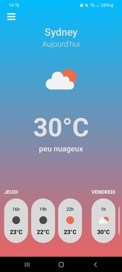

# Application météo React Native





## Introduction

Cette application météo utilise l'API OpenWeatherMap pour fournir des informations sur la météo actuelle et les prévisions pour les prochains jours, elle utilise également l'API geo.api.gouv.fr pour récupérer les villes de france. L'application permet de récupérer la position actuelle de l'utilisateur (Monde) ou bien de choisir la ville à laquelle il souhaite obtenir des informations météorologiques (En france métropolitaine).

Prochainement disponible sur le Play Store

## Fonctionnalités

* Affichage de la météo actuelle, y compris la température.
* Affichage des prévisions pour les prochains jours, méteo ainsi que température selon les heures.
* Possibilité de choisir la ville à laquelle l'utilisateur souhaite obtenir des informations météorologiques.

## Installation


Pour récupérer le projet, vous devez suivre les étapes suivantes :

1. Clonez le repository GitHub :

```
git clone https://github.com/MDFLAMorANGELS/meteo.git
```

2. Accédez au répertoire du projet :
```
cd meteo
```


3. Installez les dépendances :
```
npm install
```

4. Ajouter le .env :

```
Ajouter un fichier .env à la racine du projet
API_KEY = Votre cléé OpenWeatherMap
```

5. Lancez l'application selon la plateforme:

```
npm run web
npm run android
npm run ios
```

Si vous avez l'application Expo installée sur votre appareil, vous pouvez scanner le code QR qui s'affiche dans votre terminal pour lancer l'application directement sur votre appareil.

Pour Installer l'application méteo (uniquement disponnible sur android pour le moment):

* Décomprésser le fichierApk.zip
* Télécharger le fichier.apk
* Installer le fichier.apk sur votre appareil android


## Utilisation

Pour utiliser l'application, procédez comme suit :

L'application affiche la météo actuelle de la ville ou vous êtes actuellement.
Pour changer la ville, appuyez sur le bouton en haut à gauche pour ouvrir la fenêtre.
Saisissez le nom de la ville que vous souhaitez consulter.
Appuyez sur la ville souhaité.
L'application affichera désormais les informations météorologiques pour la ville que vous avez sélectionnée.

## Contributions
Les contributions sont les bienvenues. Si vous souhaitez contribuer au projet, veuillez suivre les instructions suivantes :

Créez une branche à partir de la branche principale :
```
git checkout -b [nom-de-la-branche]
```

2. Effectuez vos modifications.

3. Testez vos modifications.

4. Committez vos modifications :
```
git commit -am "[message-de-commit]"
```

5. Poussez vos modifications sur votre branche :
```
git push origin [nom-de-la-branche]
```

Créez une demande de tirage (pull request) pour fusionner vos modifications dans la branche principale :
git pull-request


## Licence

Cette application est publiée sous la licence GPLv3.

## Merci d'avoir utilisé cette application !

# MDFLAMorANGELS❤️
